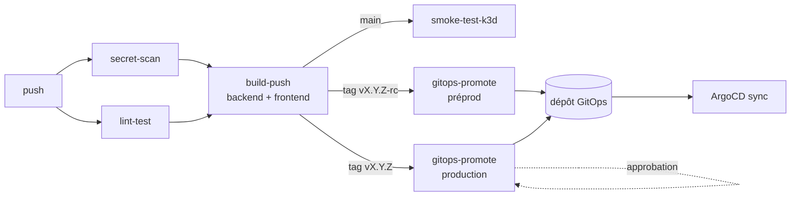

# ci-cd-templates

[](https://github.com/roxane451/ci-cd-templates/actions/workflows/ci.yml)


Bibliothèque de templates CI/CD réutilisables pour des applications
conteneurisées (backend Node.js + frontend, monorepo npm workspaces) déployées sur
Kubernetes avec Helm, en GitOps ou en mode push.

Chaque dépôt applicatif décrit son pipeline en quelques lignes ; la logique
(scan, build, tests, déploiement) est maintenue à un seul endroit, et tout ce qui
dépend du projet (dépôts, images, chemins, endpoints) est passé en paramètre.

> Ces templates sont utilisés en production par un projet privé, qui leur passe
> ses propres valeurs. Voir aussi le chart
> [`helm-fullstack-chart`](https://github.com/roxane451/helm-fullstack-chart) et
> l'infrastructure [`k3s-gitops-platform`](https://github.com/roxane451/k3s-gitops-platform).

## Plateformes

| Plateforme | Emplacement | Consommation |
|---|---|---|
| GitHub Actions | [`.github/workflows/`](.github/workflows/) | `uses: roxane451/ci-cd-templates/.github/workflows/<workflow>.yml@v1` |

## Structure

```text
ci-cd-templates/
├── .github/workflows/   # workflows réutilisables GitHub Actions + CI du dépôt
├── examples/github/     # pipeline applicatif complet
└── README.md
```

## Pipeline type



| Déclencheur | Jobs |
|---|---|
| `feature/**`, `develop`, PR | secret-scan, lint-test |
| `main` | + build, scan & push des images, smoke test k3d |
| tag `vX.Y.Z-rc` | + promotion GitOps en préprod |
| tag `vX.Y.Z` | + promotion GitOps en production, après approbation |

Pipeline complet prêt à copier : [`examples/github/app-ci-cd.yml`](examples/github/app-ci-cd.yml).

## GitHub Actions

| Workflow | Rôle |
|---|---|
| [`reusable-secret-scan.yml`](.github/workflows/reusable-secret-scan.yml) | Gitleaks sur tout l'historique Git |
| [`reusable-lint-test.yml`](.github/workflows/reusable-lint-test.yml) | Lint, tests et `npm audit` par workspace |
| [`reusable-build-push.yml`](.github/workflows/reusable-build-push.yml) | Build Docker, scan Trivy bloquant, push GHCR |
| [`reusable-smoke-test-k3d.yml`](.github/workflows/reusable-smoke-test-k3d.yml) | Déploiement du chart dans un k3d éphémère + test HTTP |
| [`reusable-gitops-promote.yml`](.github/workflows/reusable-gitops-promote.yml) | Mise à jour du tag d'image dans le dépôt GitOps (ArgoCD) |
| [`reusable-helm-deploy.yml`](.github/workflows/reusable-helm-deploy.yml) | `helm upgrade --install --atomic` direct (mode push) |
| [`reusable-update-helm-dep.yml`](.github/workflows/reusable-update-helm-dep.yml) | Montée de version d'une dépendance Helm + `Chart.lock` |

### secret-scan

| Input | Défaut | Description |
|---|---|---|
| `gitleaks-version` | `8.24.0` | Version de Gitleaks |
| `config-path` | `.gitleaks.toml` | Configuration, utilisée si le fichier existe |

Utilise le binaire Gitleaks plutôt que `gitleaks-action`, qui exige une licence
pour les dépôts d'organisation.

### lint-test

| Input | Défaut | Description |
|---|---|---|
| `node-version` | `22` | Version de Node.js |
| `workspaces` | `backend frontend` | Workspaces npm, séparés par des espaces |
| `audit-level` | `high` | Seuil `npm audit` bloquant (dépendances de production) |

`npm ci` à la racine (npm workspaces). Les scripts `lint` / `test` absents d'un
workspace sont ignorés.

### build-push

| Input | Défaut | Description |
|---|---|---|
| `image-name` | — | Image produite : `ghcr.io/<owner>/<image-name>` |
| `dockerfile` | — | Chemin du Dockerfile |
| `build-context` | `.` | Contexte Docker (racine du monorepo) |
| `trivy-severity` | `CRITICAL,HIGH` | Sévérités bloquantes |
| `upload-sarif` | `true` | Rapport Trivy dans l'onglet Security |

Outputs : `image-tag` (`vX.Y.Z` sur tag Git, `sha-<short>` sinon) et `digest`.

L'image est construite localement, **scannée, puis poussée seulement si le scan
passe** : une CVE critique ou haute corrigeable bloque le pipeline. Le push
réutilise le cache BuildKit du build scanné.

### smoke-test-k3d

| Input | Défaut | Description |
|---|---|---|
| `chart-ref` | — | Chart, ex. `oci://ghcr.io/roxane451/fullstack-app` |
| `chart-version` | dernière | Version du chart |
| `image-tag` | — | Tag des images backend et frontend |
| `values-repository` | dépôt appelant | Dépôt contenant le fichier values |
| `values-file` | — | Fichier values k3d |
| `extra-values` | — | Values YAML en ligne, appliquées après `values-file` (valeurs de test) |
| `namespace` | `smoke` | Namespace de test |
| `staged-deploy` | `false` | Déploie d'abord la base seule, puis l'application |
| `health-service` / `health-port` / `health-path` | `backend` / `5000` / `/api/health` | Endpoint sondé |
| `k3d-version` | `v5.7.4` | Version de k3d |

Secret optionnel `repo-token` (dépôt de values ou images privés), `GITHUB_TOKEN`
sinon. Le cluster, nommé d'après le run, est toujours supprimé en fin de job.

### gitops-promote

| Input | Défaut | Description |
|---|---|---|
| `environment` | — | GitHub Environment (approbation, historique des déploiements) |
| `image-tag` | — | Tag à déployer |
| `gitops-repository` | — | Dépôt GitOps (`owner/name`) |
| `values-file` | — | Fichier values à modifier |
| `image-keys` | `backend frontend` | Chemins mis à jour (`<chemin>.image.tag`), ex. `mon-chart.backend` pour un chart wrapper |

Secret requis : `gitops-token` (écriture sur le dépôt GitOps).

La modification passe par `yq` et non `sed` : seule la clé visée change, quel que
soit l'ordre des champs, et les commentaires sont préservés. Un chemin absent
fait échouer le job plutôt que de créer une clé inutile. Les promotions vers
un même dépôt sont sérialisées et le push est rejoué après rebase en cas de conflit.

### helm-deploy

Inputs : `environment`, `chart-ref`, `chart-version`, `release-name`, `namespace`,
`values-files` (un par ligne), `image-tag`, `timeout` (`5m`).
Secret requis : `KUBECONFIG_B64` (`base64 -w 0 ~/.kube/config`).

Mode push, conservé comme alternative : il impose de confier un kubeconfig à la
CI, là où le mode GitOps ne donne à la CI qu'un droit d'écriture sur un dépôt Git.

### update-helm-dep

Inputs : `dependency-name`, `dependency-version`, `chart-path` (`helm`),
`helm-repos` (dépôts classiques à ajouter, inutile pour l'OCI).

Met à jour `Chart.yaml` avec `yq`, régénère `Chart.lock`, lance `helm lint` puis
committe. Se déclenche typiquement sur un `repository_dispatch` émis à la
publication du chart dépendance.

## Permissions et secrets

Les workflows déclarent le minimum nécessaire ; le job appelant doit accorder au
moins ces permissions (voir l'exemple).

| Workflow | Permissions | Secrets |
|---|---|---|
| secret-scan, lint-test | `contents: read` | — |
| build-push | `contents: read`, `packages: write`, `security-events: write` | — (`GITHUB_TOKEN`) |
| smoke-test-k3d | `contents: read`, `packages: read` | `repo-token` (optionnel) |
| gitops-promote | `contents: read` | `gitops-token` |
| helm-deploy | `contents: read`, `packages: read` | `KUBECONFIG_B64` |
| update-helm-dep | `contents: write`, `packages: read` | — |

## Versionnement

Référencer une version plutôt que `main` :

```yaml
uses: roxane451/ci-cd-templates/.github/workflows/reusable-build-push.yml@v1
```

Les tags `vX.Y.Z` sont immuables ; le tag `v1` suit la dernière version compatible.
Les actions tierces sont épinglées et tenues à jour par Dependabot.

## Qualité

La CI du dépôt passe tous les workflows et les exemples dans
[actionlint](https://github.com/rhysd/actionlint), qui vérifie la syntaxe, les
expressions, les inputs des workflows réutilisables et les scripts shell
(via shellcheck).

## Licence

[MIT](LICENSE)
